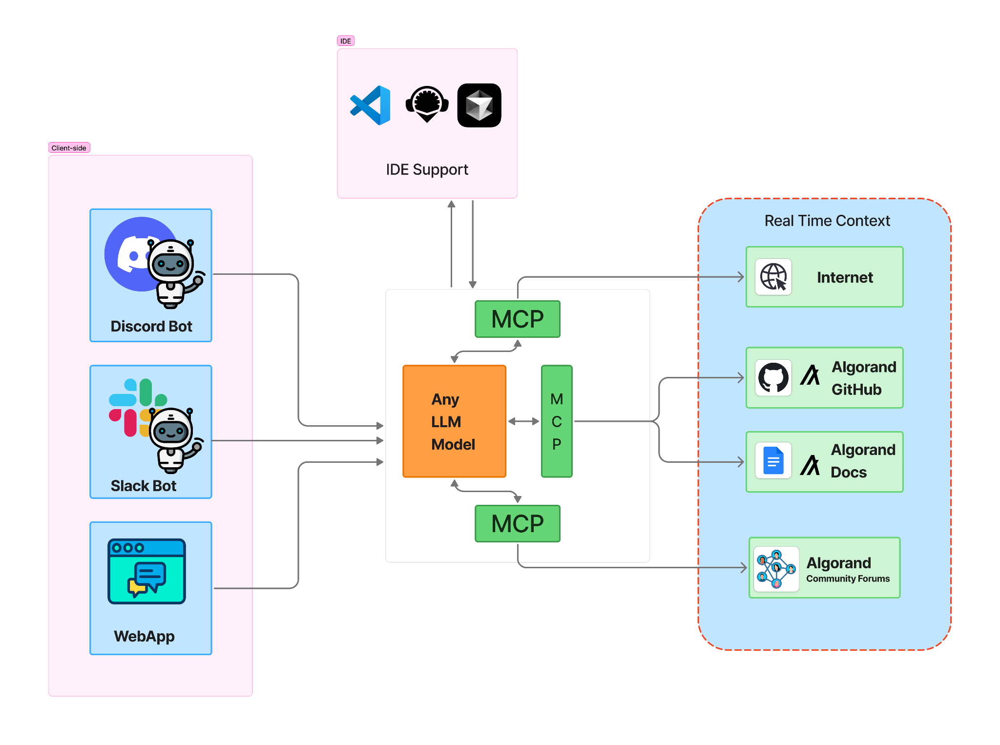
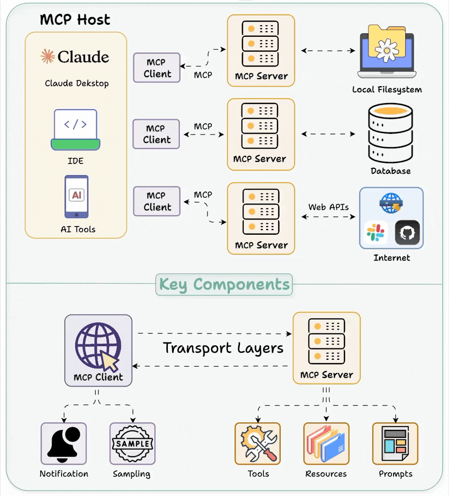

# Algorand AI Assistant

## Project Proposal

### Description
Our version of Algorand AI Assistant is an advanced, MCP server-augmented AI solution designed to accelerate development on the Algorand blockchain. By combining a powerful language model with real-time data access and specialized tools, this assistant will provide developers with contextual guidance, up-to-date information, and automated support throughout their Algorand development journey.

{width="6.270833333333333in"
height="6.927083333333333in"}
*Implementation Diagram - Architecture*

{width="6.267716535433071in"
height="4.666666666666667in"}
## Project Benefits

### 1. Developer Productivity Enhancement
- **Reduced Learning Curve**: Decrease onboarding time for new Algorand developers by 40-60% through guided learning and contextual assistance
- **Accelerated Development**: Enable 2-3x faster development cycles by providing instant answers to technical questions and code assistance
- **Error Reduction**: Minimize common mistakes and bugs through proactive code review and best practice recommendations
- **Workflow Integration**: Seamlessly integrate with existing development environments (IDEs, CLI, web) to minimize context switching

### 2. Ecosystem Growth Acceleration
- **Expanded Developer Base**: Lower barriers to entry for blockchain developers new to Algorand
- **Higher Project Completion Rates**: Reduce project abandonment through timely support at critical development roadblocks
- **Community Knowledge Amplification**: Democratize access to expert-level knowledge and best practices
- **Increased Innovation**: Enable developers to focus on building novel applications rather than solving common infrastructure challenges

### 3. Quality and Standardization
- **Best Practice Enforcement**: Promote secure, efficient coding patterns across the ecosystem
- **Consistency**: Ensure standardized approaches to common development tasks
- **Documentation Alignment**: Keep developers synchronized with the latest documentation and technical specifications
- **Security Enhancement**: Identify potential security vulnerabilities in smart contract code before deployment

### 4. Cost Efficiency
- **Support Cost Reduction**: Decrease dependency on human support resources for common questions
- **Error Resolution Savings**: Minimize costly mistakes and security issues through early detection
- **Resource Optimization**: Reduce time spent on research and troubleshooting by 30-50%
- **Scaling Economics**: Support exponentially more developers without proportional increases in support staff

### 5. Market Positioning and Competitive Advantage
- **Ecosystem Differentiation**: Position Algorand as the most developer-friendly blockchain platform
- **Talent Attraction**: Draw more developers to the ecosystem with superior tooling and support
- **Project Retention**: Reduce migration to competing blockchains by providing unmatched developer experience
- **Innovation Leadership**: Showcase Algorand's commitment to cutting-edge technology and developer success

## Technical Differentiation

### Advanced MCP Server Architecture
The Algorand AI Assistant leverages a cutting-edge MCP (Multi-Capability Protocol) server architecture that provides significant advantages over traditional LLM-only solutions:

#### Real-time Knowledge Access:
- Live connection to Algorand documentation, GitHub repositories, and community forums
- Automatic updates when new versions or features are released
- No knowledge cutoff limitations typical of standalone LLMs

#### Interactive Tool Integration:
- Direct interaction with Algorand blockchain through API connections
- Smart contract testing and simulation capabilities
- Code analysis and optimization tools
- Template generation with customization options

#### Dynamic Learning and Improvement:
- Continuous improvement through usage patterns and feedback
- Adaptation to emerging patterns and common questions
- Personalization based on individual developer preferences and history

#### Contextual Understanding:
- Maintains project context across multiple interactions
- Understands developer intent beyond explicit questions
- Provides solutions tailored to specific project requirements

## Implementation Advantages

### Scalable and Extensible Framework
- Modular architecture allowing for continuous addition of new capabilities
- Containerized deployment supporting easy scaling to meet demand
- API-first design enabling integration with existing developer tools
- Extensible tool framework for community contributions

### Robust Security Measures
- Comprehensive authentication and authorization
- Rate limiting and usage monitoring
- Code scanning for security vulnerabilities
- Privacy-preserving design with minimal data retention

### Performance Optimization
- Intelligent caching of common queries and responses
- Distributed processing for high-demand operations
- Response prioritization based on developer needs
- Background knowledge updating to maintain freshness

## Return on Investment
- **Developer Satisfaction**: Significantly improved developer experience and sentiment
- **Ecosystem Reputation**: Enhanced perception as a developer-friendly blockchain
- **Knowledge Democratization**: Equalized access to expert knowledge for developers of all experience levels
- **Innovation Enablement**: Freed developer resources to focus on creative solutions rather than technical hurdles

## Comparison: LLM-Based vs MCP Server-Augmented Agent

| Aspect | LLM-Based Agent | MCP Server-Augmented Agent |
|--------|----------------|----------------------------|
| Core Functionality | Relies on a single LLM for language tasks; limited to internal knowledge, no native external access. | LLM enhanced by MCP server; connects to tools, APIs, and data sources for dynamic, real-world interaction. |
| Latest Tech Docs | Static; uses only trained data or manually fed docs; misses updates unless retrained. | Fetches live docs via MCP tools (e.g., GitHub, official sites); no retraining needed, always current. |
| Community Forum Updates | No live access; relies on outdated training data or manual inputs; prone to inaccuracies. | Pulls real-time updates via MCP (e.g., Tavily for web/X, custom scrapers for Reddit); fresh and actionable. |
| News in Bot Tech | Limited to old news from training; can't search or fetch new articles natively. | Accesses live news via MCP (e.g., news APIs, Tavily search); tracks breakthroughs like Manus or Protégé. |
| Development Effort | Quick to start (e.g., via LangChain); custom integrations for each feature are time-intensive. | Steeper setup (MCP server + tools); scales easily with plug-and-play tools (e.g., Graphlit, Tavily). |
| Best For | Fast prototyping with basic chat features. | Long-term, scalable assistant with real-time data and extensibility. |
